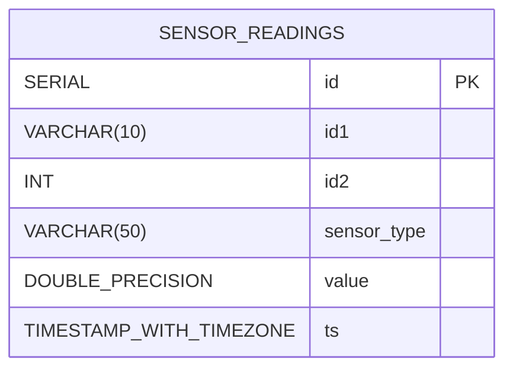

# Entity Relationship Diagram

## Database Schema

## Table Details

### sensor_readings
- **Purpose**: Stores all sensor data readings
- **Primary Key**: `id` (auto-incrementing)
- **Indexes**: 
  - Composite index on `(id1, id2, ts)` for efficient filtering

### Column Descriptions
- `id`: Unique identifier for each reading
- `id1`: First identifier (uppercase letters A-Z)
- `id2`: Second identifier (integer 0-999)
- `sensor_type`: Type of sensor (e.g., temperature, humidity, pressure)
- `value`: Sensor reading value (floating-point)
- `ts`: Timestamp when the reading was taken (with timezone)

## Relationships
Currently, this is a single-table design optimized for high-volume sensor data ingestion and time-series queries. Future enhancements could include:

- Separate `sensors` table for sensor metadata
- `sensor_types` table for sensor type definitions
- `users` table for authentication (currently using hardcoded credentials)

## Query Patterns
The schema is optimized for:
1. Time-range queries with ID filtering
2. Pagination of results
3. High-speed inserts from multiple sensor streams
4. Efficient deletion by time range or ID combination